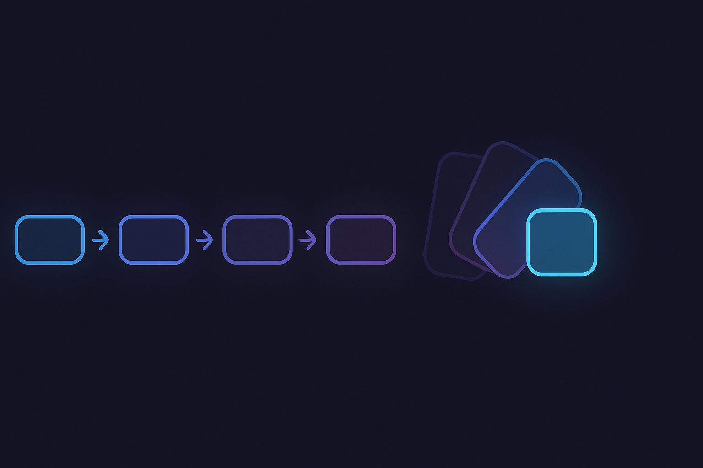
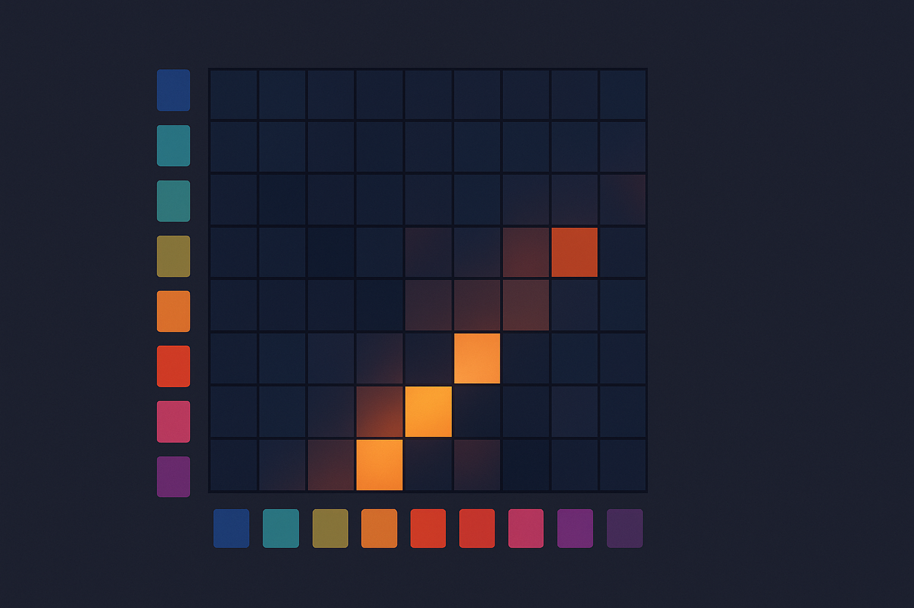
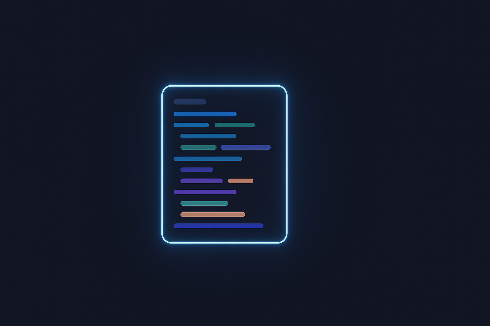
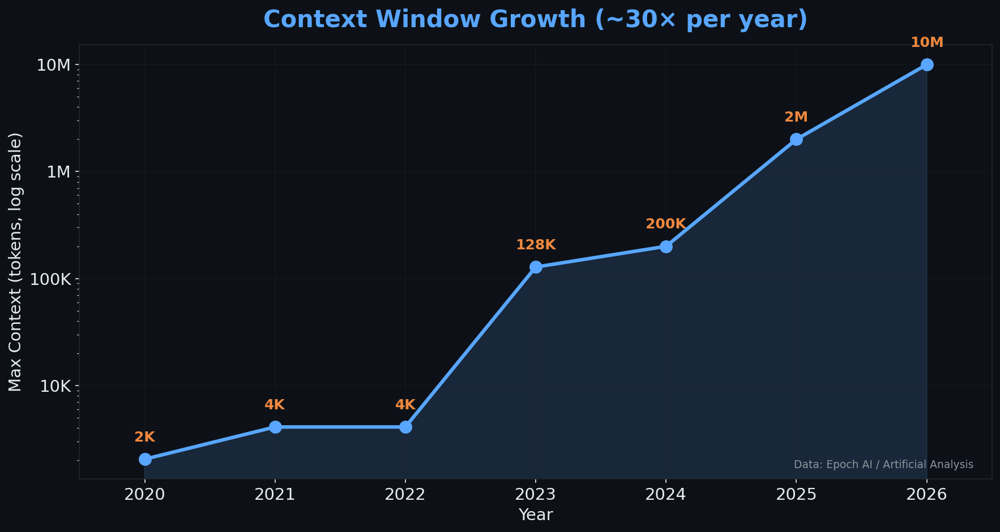
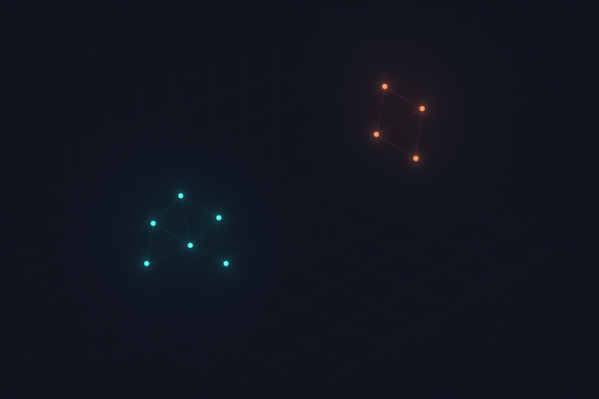
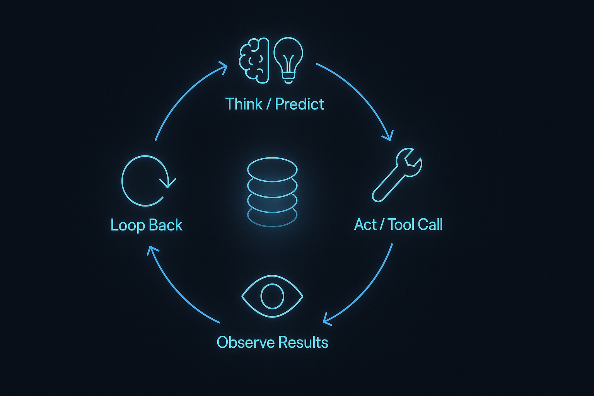
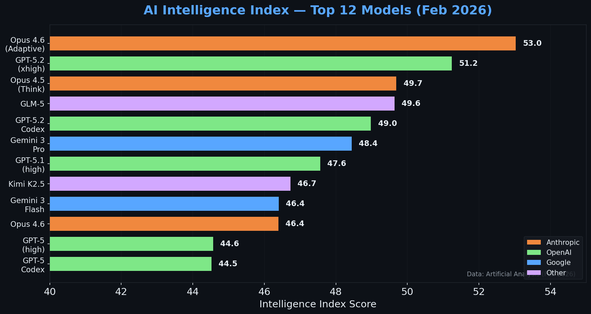
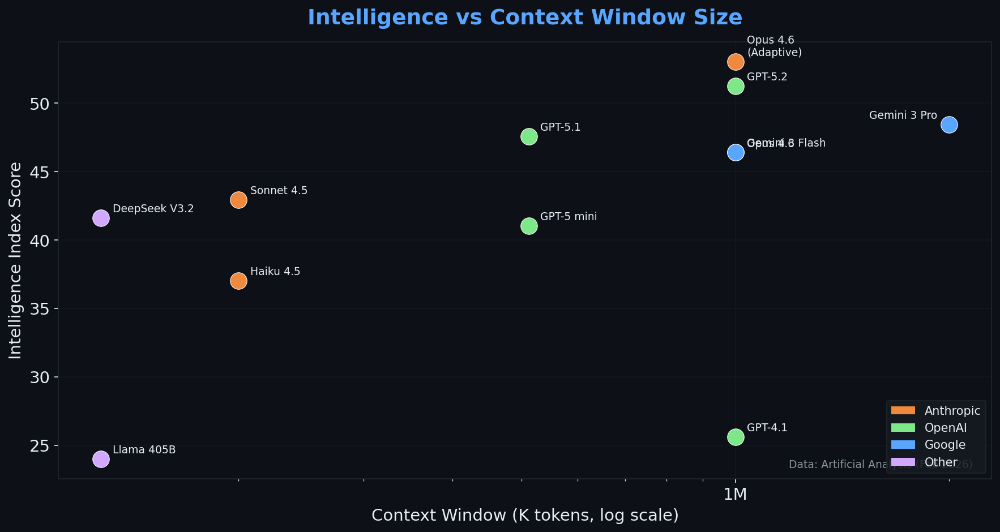

<!-- _class: lead -->
<!-- _paginate: false -->

# How LLMs Work
## Context Is Everything

**13 February 2026**

---

<!-- _class: lead -->
<!-- _paginate: false -->

<h2 style="font-size: 1.8em; font-weight: 400; line-height: 1.6; color: var(--text-primary);">
An <abbr title="Large Language Model — a neural network trained to predict text">LLM</abbr> is a <strong style="color: var(--accent-blue);">next-token prediction engine</strong><br>
operating over a <strong style="color: var(--accent-blue);">context window</strong>.
</h2>

<h2 style="font-size: 1.8em; font-weight: 400; line-height: 1.6; color: var(--text-primary); margin-top: 0.8em;">
Every "feature" — system prompts, tools, <abbr title="Model Context Protocol — a standard for connecting LLMs to external tools">MCP</abbr>, <abbr title="Retrieval-Augmented Generation — finding relevant docs and injecting them into context">RAG</abbr>, agents, skills —<br>
is just a mechanism for <strong style="color: var(--accent-orange);">putting text into that window</strong>.
</h2>

---

# What We'll Cover

1. **First Principles** — tokens, attention, the context window
2. **Context Is Everything** — what fills the window and why it matters
3. **Agents** — systems that manage context automatically
4. **Putting It Together** — where this lands and what to learn next

---

# It's Simpler Than You Think

<div class="columns">
<div>

### The paper

$$\mathcal{L}(y, \hat{y}) = -\sum_{i=1}^{N} \sum_{c=1}^{C} y_{i,c} \log(\hat{y}_{i,c})$$

*"Negative log-likelihood of the true class under the predicted distribution"*

</div>
<div>

### The code

```python
# true      = [0, 0, 1, 0]    ← correct answer
# predicted = [0.1, 0.2, 0.6, 0.1] ← model's guess
loss = -(true * log(predicted)).sum()
#          ^ element-wise multiply (×)
```

The `*` multiplies each pair — zeros cancel everything except the correct answer's confidence.

</div>
</div>

<!-- NOTES:
This slide is about demystification.

Cross-entropy loss is THE function used to train every LLM. The formula looks terrifying — double summation, logarithms, fancy script L — but it's literally just "multiply and sum."

Walking through the code:
- "true" is a one-hot vector: all zeros except a 1 at the position of the correct next token. E.g. if "mat" is word #3 in the vocabulary, true = [0, 0, 1, 0, ...].
- "predicted" is the model's probability distribution over all possible next tokens. E.g. [0.1, 0.2, 0.6, 0.1, ...].
- Multiplying them element-wise and summing just picks out the predicted probability for the correct answer (because everything else gets multiplied by 0).
- The negative log means: if predicted confidence for the right answer is high (close to 1), loss is low. If it's low (close to 0), loss is very high. This is what drives the model to improve.

Karpathy's nanoGPT is a fully functional GPT model — training and inference — in about 600 lines of Python. Not pseudocode, actual working code.

The point: don't let the notation intimidate you. The core concepts are accessible to any developer.
-->

---

# The Jargon Decoder

| They say | They mean |
|----------|-----------|
| **AI researcher** | Software engineer |
| **AI lab** | Software company |
| **Token** | A chunk of text (word or part of a word) |
| **Large Language Model** | Text prediction program |
| **Latent space** | A grid of numbers |
| **Neural network** | Functions chained together |
| **Training** | Adjusting numbers to reduce errors |
| **Inference** | Running the program |
| **Parameters** | The numbers it learned |
| **Fine-tuning** | More training on specific data |

> **nanoGPT:** a full working LLM in **~600 lines** of Python.

---

<!-- _class: divider -->


# Part 1
## First Principles: What Is an LLM?

---

# Guess the Next Token



**Given tokens → predict next token**

```
Input:  "The cat sat on the"
  → P(mat)=0.23, P(floor)=0.18 ...
  → sample → "mat"
```

<div class="small">

Ref: Raschka, *LLMs-from-scratch* — [github.com/rasbt/LLMs-from-scratch](https://github.com/rasbt/LLMs-from-scratch) · Karpathy, [*Neural Networks: Zero to Hero*](https://www.youtube.com/watch?v=VMj-3S1tku0&list=PLAqhIrjkxbuWI23v9cThsA9GvCAUhRvKZ) — excellent starting point for the fundamentals

</div>

<!-- NOTES:
An LLM does exactly one thing: given a sequence of tokens, it produces a probability distribution over all possible next tokens, then samples one.

Then it appends that token and repeats. The "streaming" effect you see in ChatGPT is literally this happening one token at a time, displayed as it's generated.

This is the entire mechanism. Everything else we'll discuss is about what goes into those input tokens (the context window) and how we choose what to put there.
-->

---

# Tokens ≠ Words

Text is split into **sub-word chunks** by a tokeniser.

| Text | Tokens | Count |
|------|--------|-------|
| `"unhappiness"` | `["un", "happi", "ness"]` | 3 |
| `"ChatGPT is great"` | `["Chat", "G", "PT", " is", " great"]` | 5 |
| `"123456"` | `["123", "456"]` | 2 |

**Rule of thumb:** 1 English word ≈ 1.3 tokens

<div class="small">

💡 Demo: Show a tokeniser in action — [platform.openai.com/tokenizer](https://platform.openai.com/tokenizer)

</div>

<!-- NOTES:
The tokeniser is what converts text into the numerical chunks the model actually processes. It splits words into subword pieces - common words might be one token, rarer words get split into multiple pieces.

This is why token counting doesn't match word counting, and why some languages are more "expensive" than others (they fragment more).
-->

---

# ⛄ Temperature (randomness) 🔥

Sampling controls how the next token is chosen:

- **Temperature 0** = greedy (highest probability wins) = **fully deterministic**
- **Temperature > 0** = adds randomness = creative, varied output
- **top-k**, **top-p** = additional randomness controls

**"LLMs aren't deterministic"** — that's a *setting*, not a limitation. Randomness is usually desirable.

<!-- NOTES:
Temperature and other sampling parameters (top-k, top-p) control how much randomness enters the token selection process.

Temperature 0 means always pick the highest probability token - completely deterministic. Same input = same output, every time.

Higher temperatures introduce randomness, which is generally what you want for creative, natural-sounding output. But you can turn it off when you need reproducibility.

When people complain about non-determinism, they're usually experiencing high temperature settings or haven't fixed the random seed. It's a configuration choice, not an inherent limitation.
-->

---

# The Transformer & Attention



Every modern LLM uses **self-attention** — each token looks at **every other token**.

```
Tokens:  128    1K      8K        128K
Pairs:   16K    1M      67M       16B
```

**n tokens = <abbr title="Quadratic — cost doubles when you double input">n²</abbr> pairwise relationships**
→ double the context = **4× the compute**

This quadratic cost is the **fundamental reason** context windows have limits.

<div class="small">

Ref: [Jay Alammar — The Illustrated Transformer](https://jalammar.github.io/illustrated-transformer/) · Raschka, [Ch 3 — Attention](https://github.com/rasbt/LLMs-from-scratch/blob/main/ch03/01_main-chapter-code/ch03.ipynb) · [Barbero et al. (2025)](https://arxiv.org/abs/2504.02732)

</div>

<!-- NOTES:
This is the core of what makes transformers powerful and expensive.

Self-attention means every token examines every other token in the context to decide what's relevant. That's n-squared pairwise relationships.

Double your context window? You've quadrupled the compute cost. This is why context windows can't just grow infinitely - the computational cost scales quadratically.

Attention sinks: Research shows LLMs tend to attend disproportionately to the first token in the sequence. It acts as a learned no-op anchor that prevents information from smearing across positions. This is a learned behaviour, not designed in.
-->

---

# The Context Window



**The central concept in this talk**

<div class="columns">
<div>

### What it is
- **ALL** the model can see
- No hidden memory, no state
- Everything serialised as tokens

</div>
<div>

### What this means
- Model is **stateless** — each call starts fresh
- Not in the window = **doesn't exist**

</div>
</div>

> 🎯 **The context window IS the model's entire reality.**

<!-- NOTES:
This is the foundational concept. The context window is literally everything the model can see. There is no hidden memory, no persistent state, no background knowledge being consulted in real-time.

Everything is serialised into tokens: your system prompt, the user's message, tool definitions, conversation history, retrieved documents - it's all one flat sequence of tokens.

The model is completely stateless. Each API call starts with a fresh context window. What looks like "memory" is just the application re-sending previous conversation turns.

And crucially: bigger windows don't automatically mean better results. As we'll see next, there's such a thing as too much context.
-->

---

# Context Windows Have Grown Fast



### But can they *use* it?

- 80% accuracy: ~250× growth/yr
- Real tasks ≠ <abbr title="Needle In A Haystack — a benchmark that hides a fact in long text">NIAH</abbr> benchmarks
- Context rot is real

**Scale reference:**
- Novel ≈ 100K tokens
- Full codebase ≈ 500K–2M tokens *(~50K–200K lines of code)*
- All of Wikipedia ≈ 4B tokens

<div class="small">

📊 Interactive: [epoch.ai/data-insights/context-windows](https://epoch.ai/data-insights/context-windows) · [artificialanalysis.ai](https://artificialanalysis.ai)

</div>

<!-- NOTES:
Context windows have grown exponentially - about 30x per year. We've gone from 4K tokens being impressive to 10M tokens being announced.

And models that can actually *use* those longer contexts effectively (80%+ accuracy at long inputs) have grown even faster - about 250x in one year.

But there's a critical caveat: most benchmarks test "needle in a haystack" - finding a specific fact buried in text. Real tasks are more complex. Semantic retrieval, reasoning over multiple facts, handling distractors - all of these degrade significantly as context grows.

For scale: a full novel is about 100K tokens. A medium-sized codebase might be 500K to 2M tokens. All of Wikipedia is roughly 4 billion tokens.

So we're approaching the point where you could theoretically fit entire codebases in context. Whether the model can effectively *use* that much context is a different question.
-->

---

# Context Rot: Bigger ≠ Better


Chroma tested 18 LLMs — **only input length varies**, task complexity constant:

<div class="columns">
<div>

### Key findings
- NIAH (lexical retrieval) ≈ solved
- **Semantic** retrieval degrades
- **Distractors** make it worse

</div>
<div>

### Implications
- NIAH scores mislead
- More tokens = more noise
- **Curation > capacity**

</div>
</div>

> **Working memory, not storage.** Overwhelm it → performance degrades.
> Opus 4.6: **93% → 76%** accuracy — same task, just more tokens.

<div class="small">

📊 [research.trychroma.com/context-rot](https://research.trychroma.com/context-rot) · [zakirullin/cognitive-load](https://github.com/zakirullin/cognitive-load)

</div>

<!-- NOTES:
This is the critical finding that changes how we think about context.

Chroma Research tested 18 different LLMs, varying only the input length while keeping task complexity constant. Their findings:

1. NIAH (needle in a haystack) - just finding a specific fact - is basically solved. Models score near 100%.

2. But semantic retrieval - understanding meaning, connecting related concepts - degrades significantly as context grows.

3. Add distractors (similar-but-wrong information) and it gets much worse.

4. The performance drop isn't uniform - it's worse in the middle of the context (the "lost in the middle" phenomenon).

The context window is working memory, not long-term storage. Just like with humans, if you overwhelm working memory with too much information, performance degrades even if technically everything "fits."

This is why curation matters more than capacity. It's not about how much you CAN fit - it's about choosing the RIGHT things to include.
-->

---

<!-- _class: divider -->


# Part 2
## Context Is Everything

---

# Building the Context

<div style="font-size: 0.7em; display: flex; gap: 1.5em; margin-top: 0.3em;">
<div>

| Layer | Owner | When |
|-------|-------|------|
| Model provider prompt | 🏢 Provider | Always |
| System prompt | 🖥️ UI | Always |
| copilot-instructions.md | 👤 User | Always |
| .instructions.md | 👤 User | Path match |
| AGENTS.md | 👤 User | Nearest in tree |
| Tool definitions | 🖥️ UI | Always |

</div>
<div>

| Layer | Owner | When |
|-------|-------|------|
| MCP server schemas | 👤 User | Config'd |
| Loaded SKILL.md | 🤖 Agent | On demand |
| Custom agents (.agent.md) | 👤 User | Invoked |
| Hooks | 👤 User | Event-driven |
| Conversation history | 🖥️ UI | Compacted |
| Retrieved context | 🤖 Agent | Tool calls |
| User's current message | 👤 User | Always |

</div>
</div>

**All markdown → tokens → context.** The model doesn't distinguish layers.

<!-- NOTES:
This diagram shows everything that actually goes into the context window for a single turn of Copilot CLI.

Starting from the top:
- Built-in system prompt (defines the agent's role and capabilities)
- copilot-instructions.md (repo-wide rules, always loaded)
- .instructions.md files (path-scoped rules that only apply to certain files)
- AGENTS.md (agent-specific instructions from the nearest file in the directory tree)
- Tool definitions - JSON schemas for bash, view, edit, grep, glob, and others
- MCP server tools - external tools from Model Context Protocol servers
- Skills - lazy-loaded markdown files the LLM can choose to load when relevant
- Conversation history - previous turns, often compacted/summarised to save space
- Retrieved context - files and search results the agent pulled in via tools
- The user's actual message

All of this gets serialized into tokens and fed into the model as one flat sequence. The model doesn't "know" which parts are system prompt vs. user message vs. tool output - it's all just tokens in context.

And from there, it predicts the next token. That's the entire process.
-->

---

# 💡 What's in the System Prompt?

System prompts reveal what's loaded before you even type:

<div class="columns">
<div>

### Copilot CLI
- Tool definitions (bash, view, edit…)
- Session context + environment
- Custom instructions from repo
- Behavioural rules + tone
- Skills + agent config

</div>
<div>

### ChatGPT / Claude
- Thousands of tokens each
- Personality + safety rules
- Tool schemas (DALL-E, browsing…)
- Knowledge cutoff info
- Prepended to **every request**

</div>
</div>

<div class="small">

💡 Demo: [github.com/asgeirtj/system_prompts_leaks](https://github.com/asgeirtj/system_prompts_leaks) ★ 31k

</div>

<!-- NOTES:
You can actually see what's in these system prompts by using prompt injection techniques to make the model reveal them.

For Copilot CLI, that includes all the tool definitions, session context, any custom instructions from your repo's .github directory, behavioural rules about how to respond, and skills/agent configuration.

For ChatGPT and Claude, their system prompts are thousands of tokens long. They include personality traits, safety guardrails, tool schemas for features like DALL-E or web browsing, knowledge cutoff dates, and much more.

All of this is prepended to every single message you send. It's already consuming tokens before you even start your conversation.

The linked repo has a collection of leaked system prompts from various AI assistants - worth browsing to see just how much context is being used by default.
-->

---

# "Features" Are Just Context Injection

| Feature | What it actually does | Example |
|---------|----------------------|---------|
| **System prompt** | Text prepended to every request | [Leaked system prompts](https://github.com/asgeirtj/system_prompts_leaks) |
| **copilot-instructions.md** | Repo-wide rules, auto-loaded | [Docs](https://docs.github.com/en/copilot/customizing-copilot/adding-repository-custom-instructions-for-github-copilot) |
| **Tools (function calling)** | <abbr title="JavaScript Object Notation — structured data format">JSON</abbr> schemas describing actions | [OpenAI function calling](https://platform.openai.com/docs/guides/function-calling) |
| **<abbr title="Model Context Protocol — a standard for connecting LLMs to external tools">MCP</abbr> servers** | Tool schemas from external process | [MCP spec](https://modelcontextprotocol.io/) |
| **<abbr title="Retrieval-Augmented Generation — finding relevant docs and injecting them into context">RAG</abbr>** | Retrieves text chunks, injects them | [Anthropic RAG guide](https://docs.anthropic.com/en/docs/build-with-claude/retrieval-augmented-generation) |
| **Skills** | Markdown lazy-loaded when relevant | [Copilot skills](https://docs.github.com/en/copilot/customizing-copilot/copilot-skills) |
| **Sub-agents** | Fresh window + tailored prompt | [Agents & sub-agents](https://docs.github.com/en/copilot/customizing-copilot/copilot-agents) |
| **Conversation history** | Prior turns, often summarised | [Context compaction](https://docs.anthropic.com/en/docs/build-with-claude/prompt-caching) |
| **Few-shot examples** | Example pairs pasted into context | [Few-shot prompting](https://platform.openai.com/docs/guides/prompt-engineering#tactic-provide-examples) |
| **Reasoning / thinking** | Chain-of-thought tokens generated & read | [Extended thinking](https://docs.anthropic.com/en/docs/build-with-claude/extended-thinking) |

<!-- NOTES:
This table is the key insight: every "feature" you hear about - system prompts, tools, RAG, skills, agents - underneath they're all doing the same thing: putting text into the context window.

The only differences are WHAT gets injected and WHEN:
- System prompts: always loaded, every request
- copilot-instructions.md: loaded at session start
- Tools: JSON schemas, loaded when relevant
- MCP servers: same as tools, but defined externally - can easily add 50k+ tokens
- RAG: retrieves relevant documents and injects them per-query
- Skills: lazy-loaded on demand when the LLM decides it needs them
- Sub-agents: actually create a fresh context window with a specialised prompt
- History: grows with each turn, often compacted
- Few-shot examples: static examples included in the prompt
- Reasoning: special case - the model generates chain-of-thought tokens and then reads them back as part of its context

Understanding this pattern changes how you think about all these features. They're not fundamentally different mechanisms - they're all variations on context injection.
-->

---

# The Scale Problem

Real-world overhead from Anthropic's engineering team:

<div class="columns">
<div>

<div class="stat">134,000</div>
<div class="stat-label">tokens of tool definitions<br>in Anthropic's internal setup<br><em>before any conversation</em></div>

</div>
<div>

### 5-MCP-server example

| Server | Tools | Tokens |
|--------|-------|--------|
| GitHub | 35 | ~20,000 |
| Slack | 11 | ~8,000 |
| Sentry | 5 | ~5,000 |
| Grafana | 5 | ~5,000 |
| Splunk | 2 | ~2,000 |
| **Total** | **58** | **~55,000** |

Add Jira → **100k+ overhead**

</div>
</div>

<div class="small">

Ref: Anthropic — ["Advanced Tool Use"](https://www.anthropic.com/engineering/advanced-tool-use) (2025)

</div>

<!-- NOTES:
This is from Anthropic's own engineering blog, discussing their internal tooling setup.

They revealed that their internal Claude setup - before any conversation even starts - loads 134,000 tokens worth of tool definitions. That's roughly the length of a novel, just in function schemas.

The right column shows a realistic 5-MCP-server setup: GitHub, Slack, Sentry, Grafana, and Splunk. That's 58 tools totaling around 55,000 tokens of overhead.

Add one more server like Jira and you're approaching 100k tokens of pure overhead before any actual work happens.

This is why the next slide's solution - the tool search tool - is so important. You can't keep scaling linearly by loading every possible tool upfront.
-->

---

# The Tool Search Tool

Instead of loading 58 tools (~55k tokens), give the model **one search tool** (~500 tokens):

<div class="columns">
<div>

### Context reduction

<div class="stat">85%</div>
<div class="stat-label">fewer tokens<br>55,000 → 3,000</div>

</div>
<div>

### Accuracy *improved*

| Model | Before | After |
|-------|--------|-------|
| Opus 4 | 49% | **74%** |
| Opus 4.5 | 79.5% | **88.1%** |

**Less noise = better decisions**

</div>
</div>

<div class="small">

Ref: Anthropic — ["Advanced Tool Use"](https://www.anthropic.com/engineering/advanced-tool-use) (2025)

</div>

<!-- NOTES:
This is a brilliant solution to the tool overhead problem.

Instead of loading all 58 tool schemas upfront (55k tokens), give the model a single "tool search" tool that lets it discover tools on demand.

The results from Anthropic's testing:
- 85% reduction in tokens (55k down to ~3k)
- And accuracy actually IMPROVED

For Opus 4: 49% → 74% (+25 points)
For Opus 4.5: 79.5% → 88.1% (+8.6 points)

This is the context rot principle in action. By reducing the noise in the context window, the model makes better decisions about which tools to use.

It discovers tools just-in-time as needed, rather than being overwhelmed with dozens of schemas upfront.

This is a pattern we'll see again: more context isn't always better. Curation matters.
-->

---

# Finding the Right Context



Two strategies, same goal: get the right text into the window.

| | **RAG** | **Agent tools** |
|---|---------|----------------|
| **How** | Pre-indexed vectors → similarity search | `grep`, `glob`, `view` at runtime |
| **Speed** | Fast lookup | Slower, multi-step |
| **Freshness** | Can go stale | Always current |
| **Who decides** | Retrieval pipeline | The model itself |

Both are just **context injection** — the difference is *when* and *who* picks what goes in.

<!-- NOTES:
This slide ties back to the core thesis: it's all about what ends up in the context window.

RAG and agent tools are two strategies for the same problem — your codebase is too big to fit, so you need to find the relevant parts.

RAG pre-indexes everything into vectors (embeddings) and does fast similarity search. Great for large doc collections, but the index can go stale and a pipeline decides what's relevant before the model even sees the query.

Agent tools (grep, glob, view) let the model search just-in-time. Slower, but always fresh, and the model decides what's relevant based on the actual task.

Copilot CLI uses agent tools. ChatGPT's file search uses RAG. Many systems combine both.

The point is: neither is magic. They're both just ways to get the right text into the window.
-->

---

# Context Engineering > Prompt Engineering

| Era | Focus |
|-----|-------|
| **2023** | "Write a good prompt" |
| **2024** | "Give it examples + tools" |
| **2025–26** | **"Engineer the entire context pipeline"** |

> *"Context engineering is the delicate art and science of filling the context window with just the right information for the next step."*
> — **Andrej Karpathy**

> *"The art of providing all the context for the task to be plausibly solvable by the LLM."*
> — **Tobi Lütke**, Shopify CEO

**The Goldilocks problem:** 🔻 Too little → hallucinates · 🔺 Too much → diluted attention · ✅ Just right

<div class="small">

[simonwillison.net/2025/Jun/27/context-engineering](https://simonwillison.net/2025/Jun/27/context-engineering/) · [Anthropic — "Effective Context Engineering"](https://www.anthropic.com/engineering/effective-context-engineering-for-ai-agents)

</div>

<!-- NOTES:
The focus has shifted from "write a better prompt" to "engineer what goes into the context."

2023: Just write a good prompt. Be clear, be specific.

2024: Add few-shot examples. Give it tools. Show it how to think.

2025-26: Engineer the ENTIRE context pipeline. Control what gets loaded, when, how much, in what format. This is systems engineering, not just prompt writing.

Karpathy and Lütke both call this out: context engineering is about putting "just the right information" into the window at each step.

The Goldilocks problem: Too little context and it hallucinates. Too much and attention gets diluted (context rot). You need just the right amount - the smallest set of high-signal tokens that makes the task solvable.

This is why all the mechanisms we're discussing - Skills, RAG, tool search, sub-agents - exist. They're all ways to manage this tradeoff.
-->

---

<!-- _class: divider -->


# Part 3
## Agents: Systems That Manage Context

---

# The Agent Loop



> *"An LLM that runs tools in a loop to achieve a goal."*
> — **Simon Willison**

**Think → Act → Observe → Loop**

Each iteration, the context grows.
Effectiveness depends entirely on what's in that window.

<div class="small">

Ref: Willison — ["2025: The Year in LLMs"](https://simonwillison.net/2025/Dec/31/the-year-in-llms/)

</div>

<!-- NOTES:
This is Simon Willison's definition of an agent: "An LLM that runs tools in a loop to achieve a goal."

Here's how it works:
1. User makes a request
2. LLM predicts the next tokens, which might include a tool call (e.g., "read this file")
3. The tool executes and returns results
4. Those results go back into the context window
5. LLM predicts again - might call another tool, might respond to the user
6. Repeat until the task is done

The key insight: with each iteration, the context window grows. The agent is accumulating tool outputs, partial results, observations.

The agent's effectiveness depends entirely on:
1. What's already in the window (instructions, examples, prior results)
2. What tools it has access to
3. How well it can manage the growing context (when to summarise, what to keep, what to discard)

This is context engineering in motion - actively managing what stays in the window throughout a multi-step task.
-->

---

# Managing Context

When agents work 30+ minutes, context fills up. **Three strategies:**

1. **Compaction** — summarise conversation, start fresh
2. **Structured Note-Taking** — external files for persistent memory
3. **Sub-Agents** — fresh window for focused sub-tasks

<div class="small">

Ref: [Anthropic — "Effective Context Engineering"](https://www.anthropic.com/engineering/effective-context-engineering-for-ai-agents) · [Fowler — sub-agents](https://martinfowler.com/articles/exploring-gen-ai/context-engineering-coding-agents.html)

</div>

<!-- NOTES:
Context management is a first-class concern when building agents. You can't just let context grow unbounded.

These three strategies are often used in combination. For example, Copilot CLI might:
1. Use structured note-taking to track the plan
2. Automatically compact the conversation history when it gets too long
3. Spawn a sub-agent for a complex sub-task like "audit all API endpoints for security issues"

Let's look at each one.
-->

---

# Strategy 1: Compaction

**Summarise conversation → start fresh with summary**

- Preserves decisions, discards verbose tool output
- Copilot CLI does this automatically
- Compression ratio: ~10:1 typical

<!-- NOTES:
When context fills up, one strategy is compaction.

Take the entire conversation history, summarise the key points and decisions, and start a fresh context window with that summary.

Copilot CLI does this automatically. It preserves the decisions that were made and the current state, but discards verbose tool outputs that aren't needed anymore.

Typical compression: about 10:1. A 50k token conversation might compress to a 5k token summary.

The tradeoff: you lose fine-grained details. But you keep the essential context needed to continue.
-->

---

# Strategy 2: Structured Note-Taking

**Agent writes to external files, reads back later**

- Plan.md, to-do lists, decision logs
- Survives context resets
- Copilot CLI: session workspace for persistent notes

<!-- NOTES:
Second strategy: structured note-taking.

Instead of trying to keep everything in the context window, the agent writes important information to external files: plan.md, to-do lists, decision logs.

These files persist across context resets. When the agent needs that information again, it just reads the file.

Copilot CLI provides a session workspace specifically for this - a place where the agent can keep notes that survive context compaction.

This is essentially giving the agent external memory. The context window is working memory, these files are long-term storage.
-->

---

# Strategy 3: Sub-Agents

**Fresh context window for focused sub-task**

- `.agent.md` file defines specialised persona + curated tools
- Might use 50k+ tokens exploring
- Returns concise summary to parent agent

<!-- NOTES:
Third strategy: sub-agents.

Create a fresh, specialised context window for a focused sub-task.

A .agent.md file defines:
- A specialised persona (e.g., "security audit specialist")
- Curated tools (only what's needed for this task)
- Custom instructions specific to this sub-task

The sub-agent might use 50k+ tokens exploring the codebase, running tools, reasoning about the problem.

But it returns just a concise summary to the parent agent - maybe 2k tokens of findings.

This lets you go deep on a specific task without polluting the parent agent's context with all the detailed exploration.
-->

---

# The Convergence

All major coding agents → **same pattern**, different names:

| Concept | Claude Code | GitHub Copilot | Cursor |
|---------|------------|----------------|--------|
| Always-on rules | `CLAUDE.md` | `copilot-instructions.md` | `.cursorrules` |
| Path-scoped rules | Rules (`*.ts`) | `.instructions.md` + `applyTo` | "Apply intelligently" |
| Lazy-loaded context | Skills (`SKILL.md`) | Agent Skills (`SKILL.md`) | Evolving → Skills |
| Specialised agents | Sub-agents | Custom Agents (`.agent.md`) | Sub-agents (new) |
| External tool access | MCP servers | MCP servers | MCP servers |
| Lifecycle scripts | Hooks | Hooks | Hooks (new) |

**Same mechanism:** curate what goes in, control when it loads.

<!-- NOTES:
This is fascinating - all three major coding agents independently converged on the same architecture.

Different names, same underlying pattern:

Always-on rules: CLAUDE.md vs copilot-instructions.md vs .cursorrules - but they all do the same thing. Load rules for every request.

Path-scoped: Apply rules only to certain files. All three support this.

Lazy-loaded context: Skills that get loaded on-demand. All moving toward this.

Specialised agents: Sub-agents or custom agents for focused tasks. All support this now.

MCP: All three adopted the Model Context Protocol for external tool access.

Hooks: Lifecycle scripts that run at certain points. All adding this.

This convergence isn't a coincidence. They're all solving the same fundamental problem: how to curate what text goes into the context window, and when.

The naming is just surface-level differences. The mechanism is universal.
-->

---

# Calibrating Trust

> *"We still need to think in probabilities and choose the right level of human oversight for the job."*
> — **Martin Fowler**

Context engineering increases **probability** of good output — but models are probabilistic, not deterministic.

**In practice (Feb 2026), they're remarkably reliable:**
- Follow instructions consistently when context is well-engineered
- Mistakes are mostly edge cases, not routine failures
- The better the context, the more you can trust the output

**Match oversight to stakes:**
- 🟢 Most tasks — let it run, review Ctrl+Y the diff
- 🟡 Sensitive data — log and spot-check
- 🔴 Irreversible actions — require human approval

<div class="small">

Ref: Fowler — ["Beware: Illusion of control"](https://martinfowler.com/articles/exploring-gen-ai/context-engineering-coding-agents.html) · [HumanLayer — Function Stakes](https://github.com/humanlayer/humanlayer)

</div>

<!-- NOTES:
This slide is about calibrating trust appropriately for 2026.

Models have improved dramatically. With well-engineered context, they follow instructions reliably. The failure mode is usually edge cases or ambiguous requirements, not routine disobedience.

The key insight from Fowler still holds: these are probabilistic systems, not deterministic ones. But the probabilities have shifted heavily in our favour.

Practical calibration:
- For most coding tasks, let the agent run and review the diff. This is how most people work with Copilot CLI day-to-day.
- For sensitive data access, keep logs and spot-check.
- For truly irreversible actions (sending emails, deploying to prod, deleting data), require explicit human approval.

The point isn't "don't trust models" — it's "trust them proportionally to how well you've set up the context, and how reversible the action is."
-->
And if code is hard for humans to understand (high cognitive load), it's hard for LLMs too. Clean, well-structured code with clear patterns makes context engineering easier.

So how do you handle this uncertainty? Fowler and HumanLayer advocate for calibrating human oversight to the stakes:

Green (low stakes): Reading public data, analyzing code. Let the agent run autonomously.

Yellow (medium): Reading private data, accessing internal systems. Log everything and review.

Red (high stakes): Write access, sending messages on your behalf, making purchases. Require explicit human approval before executing.

This is "deterministic instructions → probabilistic influence." You can't control the output perfectly, so you control the blast radius instead.
-->

---

<!-- _class: divider -->


# Part 4
## Putting It Together

---

# Coding Agent Progression



**<abbr title="Software Engineering Benchmark — real GitHub issues solved autonomously">SWE-bench</abbr> Full:** % of real issues resolved

| Model | Score |
|-------|-------|
| GPT-4 *(Oct 2023)* | **1.7%** |
| GPT-4o *(Jun 2024)* | **22%** |
| Claude 3.5 Sonnet *(Oct 2024)* | **49%** |
| Opus 4.6 (Thinking) | **79.2%** |
| Gemini 3 Flash | 76.2% |
| GPT 5.2 | 75.4% |
| Opus 4.5 | 74.6% |

**The formula:** Reasoning + tools + context engineering

<div class="small">

📊 [swebench.com](https://swebench.com) · [artificialanalysis.ai](https://artificialanalysis.ai)

</div>

<!-- NOTES:
SWE-bench Full is the gold standard benchmark: real GitHub issues from real repositories. Can the agent autonomously resolve the issue?

Look at these scores. We're approaching 80% on REAL software engineering tasks.

Claude Opus 4.6 with thinking (extended reasoning): 79.2%
The top 6 models are all above 70%.

A year ago, anything above 30% was impressive.

The formula that made this possible:
1. Reasoning models (extended chain-of-thought)
2. Tools (ability to read code, edit files, run tests, search)
3. Context engineering (putting the right information in the window at the right time)

When you combine those three, you get agents that can plan a solution, execute it, observe the results, and iterate until it works.

This is why GitHub Copilot has evolved from code completion to a full autonomous agent that can resolve PRs.

The context window - and how we fill it - is the foundation that makes this possible.
-->

---

# Context Engineering Is the New Core Skill

Every tool, framework, product — **all solving the same problem:**

**What text goes into the context window?**

<div class="columns">
<div>

### It transfers
- Copilot → Cursor → Claude → Gemini
- Chat → agents → code review → CI
- Models change; context doesn't

</div>
<div>

### It compounds
- Good instructions → every conversation improves
- Good tool design → every agent loop improves
- Good code structure → every AI interaction improves

</div>
</div>

**HumanLayer's *12 Factor Agents*:** "Own your context window" — actively curate, don't leave it to frameworks.

<div class="small">

Ref: [HumanLayer — 12 Factor Agents](https://github.com/humanlayer/12-factor-agents) · [humanlayer.dev](https://humanlayer.dev)

</div>

<!-- NOTES:
This is the fundamental skill that transfers everywhere.

Understanding context engineering means:
- Your knowledge transfers from Copilot to Cursor to Claude Code to Gemini CLI
- The principles work for chat, agents, code review, CI automation
- The models will keep changing and improving, but context engineering principles remain constant

And it compounds:
- Write good copilot-instructions.md once → every conversation in that repo benefits
- Design tools well → every agent loop that uses those tools benefits
- Structure your code clearly → every AI interaction with that code benefits

HumanLayer's 12 Factor Agents codifies this: "Own your context window."

Don't just accept whatever the framework decides to load. Actively curate:
- What goes in
- When it gets loaded
- How much space it consumes
- What gets evicted when you run out of room

This is production engineering for AI agents. Context is infrastructure.
-->

---

<!-- _class: lead -->

# What We Covered *(& what to remember)*

<div style="text-align: left; font-size: 0.95em;">

**Part 1** — LLMs <span style="color: var(--accent-blue);">predict the next token</span>. That's the entire mechanism.

**Part 2** — The <span style="color: var(--accent-blue);">context window</span> is all they see. Every "feature" is just putting text into it.

**Part 3** — Agents are loops that <span style="color: var(--accent-orange);">manage context</span>: compaction, notes, sub-agents.

**Part 4** — SWE-bench: 1.7% → 79% in two years. <span style="color: var(--accent-orange);">Context engineering</span> is why.

🔑 This applies whether you're **building or using** AI.

</div>

---

<!-- _class: lead -->
<!-- _paginate: false -->

# Thank You

**Context is everything.**

All slides, outline, and references:
`github.com/crmitchelmore/context-presentation`

---

<!-- _paginate: false -->

# 📣 Next Friday: Your Turn

**Crowd-sourced content — AI adoption in practice**

Anything goes: technical, non-technical, a demo, tips & tricks, a workflow, a war story…

- **1–10 minutes** per slot
- Live demo or pre-recorded video — both welcome
- If oversubscribed, we'll add a second session

**Drop me a message on Teams** and I'll schedule you in.

---

# Key Graphs & Data Sources



Bookmark these — live, interactive data:

| Resource | What it shows |
|----------|--------------|
| [epoch.ai](https://epoch.ai/data-insights/context-windows) | Context window growth (30×/yr) |
| [trychroma.com](https://research.trychroma.com/context-rot) | Context rot vs input length |
| [artificialanalysis.ai](https://artificialanalysis.ai/models) | Quality, speed, price, context |
| [swebench.com](https://swebench.com) | Coding agent leaderboard |
| [attentionviz.com](http://attentionviz.com) | Attention visualisation |
| [openai.com/tokenizer](https://platform.openai.com/tokenizer) | Live tokeniser |

---

# References & Further Reading

<div class="columns">
<div>

### Essential
1. [Fowler — "Context Engineering for Coding Agents"](https://martinfowler.com/articles/exploring-gen-ai/context-engineering-coding-agents.html)
2. [Anthropic — "Effective Context Engineering"](https://www.anthropic.com/engineering/effective-context-engineering-for-ai-agents)
3. [Willison — "Context Engineering"](https://simonwillison.net/2025/Jun/27/context-engineering/)
4. [Anthropic — "Advanced Tool Use"](https://www.anthropic.com/engineering/advanced-tool-use)

### Fundamentals
5. [Raschka — *LLMs-from-scratch*](https://github.com/rasbt/LLMs-from-scratch)
6. [Karpathy — *Neural Networks: Zero to Hero*](https://www.youtube.com/watch?v=VMj-3S1tku0&list=PLAqhIrjkxbuWI23v9cThsA9GvCAUhRvKZ)
7. [Karpathy — nanoGPT](https://github.com/karpathy/nanoGPT)
8. [Barbero et al. — "Attention sinks"](https://arxiv.org/abs/2504.02732)

</div>
<div>

### Show & Tell
8. [system_prompts_leaks](https://github.com/asgeirtj/system_prompts_leaks)
9. [anthropics/skills](https://github.com/anthropics/skills)
10. [Chroma — Context Rot](https://research.trychroma.com/context-rot)

### GitHub Copilot
11. [Custom Instructions](https://docs.github.com/en/copilot/customizing-copilot/adding-repository-custom-instructions-for-github-copilot)
12. [Custom Agents](https://docs.github.com/en/copilot/how-tos/use-copilot-agents/coding-agent/create-custom-agents)

### Broader
13. [zakirullin/cognitive-load](https://github.com/zakirullin/cognitive-load)
14. [HumanLayer — 12 Factor Agents](https://github.com/humanlayer/12-factor-agents)
15. [Epoch AI — Context Windows](https://epoch.ai/data-insights/context-windows)
16. [Artificial Analysis](https://artificialanalysis.ai/models)

</div>
</div>
